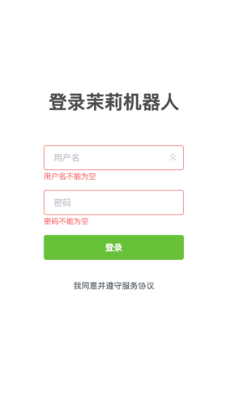
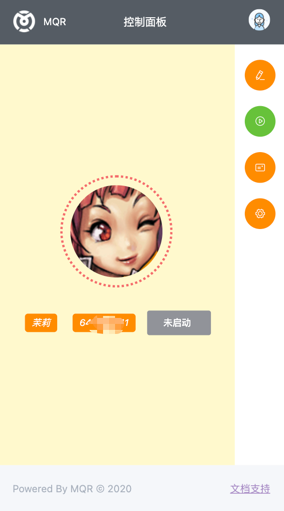
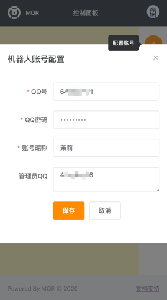
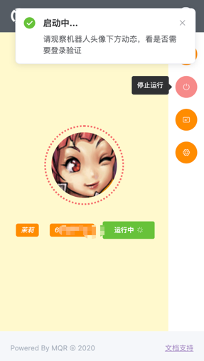
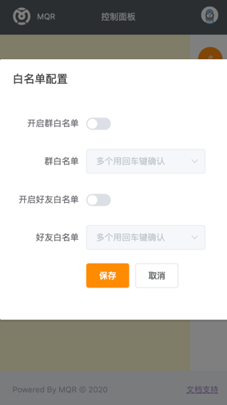
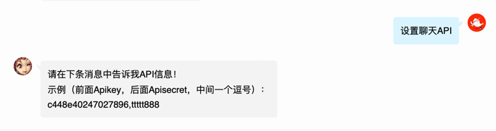

## 茉莉QQ机器人（简称MQR）

### 介绍
采用mirai的Android协议实现的QQ机器人服务，可以通过[web页面](https://github.com/xggz/mqr-web)控制机器人的运行。

### 软件架构
`MQR` 使用Java语言开发（jdk 8），技术栈：`Spring Boot` + `JWT` + `Mybatis Plus` + `Sqlite`，查看和运行源码的 IDE 需安装 `lombok` 插件。

### 运行程序和启动机器人
本仓库代码默认已经集成了最新的web页面，程序（主程序在`mqr-rest`模块）运行成功之后，
直接用浏览器访问[http://127.0.0.1:8181](http://127.0.0.1:8181)即可。

默认登录账号：`admin`，密码：`123456`

登录成功之后设置机器人账号和密码，然后启动机器人运行，之后机器人会自动运行。

### Docker运行
#### 官方容器镜像服务：
```
docker pull xggz/mqr:latest
```
#### 阿里云容器镜像服务：
```
docker pull registry.cn-shenzhen.aliyuncs.com/xggz/mqr:latest
```

### 演示页面截图







### 聊天对话API
智能对话使用的是茉莉机器人`内测版`接口，请访问[https://mly.app](https://mly.app)获取智能聊天对话的`ApiKey`和`ApiSecret`。

获取到机器人`ApiKey`和`ApiSecret`后，私聊机器人：


### 声明
#### 一切开发旨在学习，请勿用于非法用途
- mqr 是完全免费且开放源代码的软件，仅供学习和娱乐用途使用；
- mqr 不会通过任何方式强制收取费用，或对使用者提出物质条件；
- 鉴于项目的特殊性，开发团队可能在任何时间**停止更新**或**删除项目**。